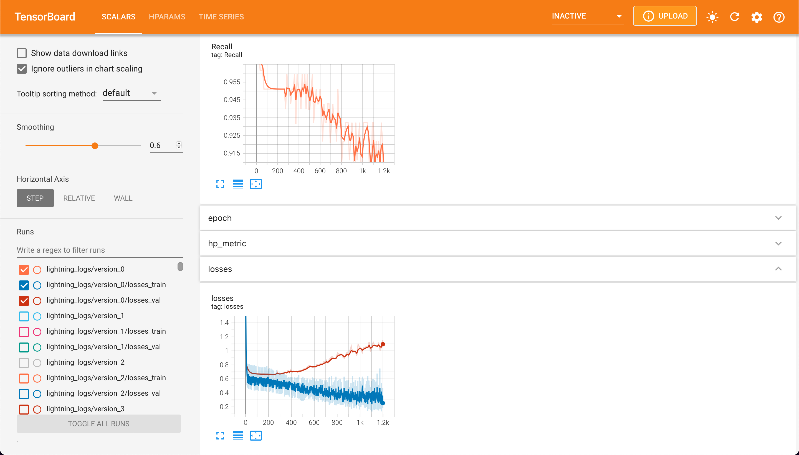
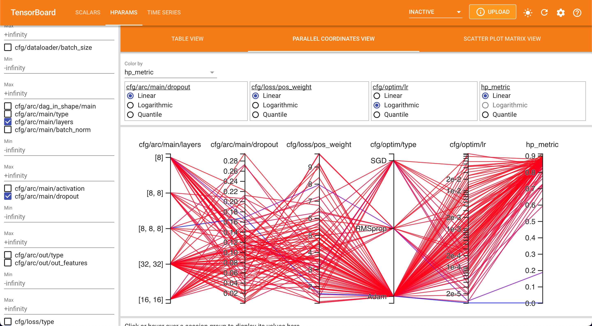
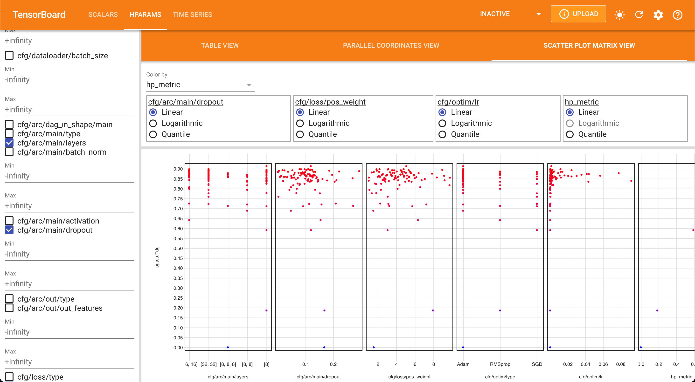

# lean-dl-example

Example of a lean deep learning project with a config-driven approach.

This example uses:

- [Hydra](https://hydra.cc) for composable config
- [feature_transform](https://github.com/kengz/feature_transform) to build Scikit ColumnTransformers by specifying configs.
- [TorchArc](https://github.com/kengz/torcharc) to build PyTorch models by specifying architectures.
- [PyTorch Lightning](https://www.pytorchlightning.ai) to accelerate PyTorch engineering.
- [Optuna (with Hydra)](https://hydra.cc/docs/plugins/optuna_sweeper/) for hyperparameter search
- [PyTorch-TensorBoard](https://pytorch.org/docs/stable/tensorboard.html) for visualizing training progress and hyperparameter search

## Installation

Create a virtual environment and install dependencies.
[Install uv](https://docs.astral.sh/uv/getting-started/installation/) for dependency management if you haven't already. Then run:

```bash
# setup virtualenv
uv sync
```

## Usage

### Unit Test

Run unit test to ensure module is set up correctly.

```bash
uv run pytest
```

### Training

Inspect/modify the Hydra config in [config/](./config/). Then run:

```bash
uv run dl/train.py

# fault tolerant (resumable) training
PL_FAULT_TOLERANT_TRAINING=1 uv run dl/train.py

# to change configs
uv run dl/train.py dataloader.batch_size=32 model.modules.mlp.compact.layer.args='[64,64]'
```

When training ends, besides PyTorch Lightning checkpoint, it will also export to ONNX model `model.onnx`.

### Serving

The example [app/main.py](app/main.py) uses FastAPI to serve the exported ONNX model for inference. To run:

```bash
uv run gunicorn app.main:app -k uvicorn.workers.UvicornWorker --bind 0.0.0.0:8000
```

### Hyperparameter Search

By using config-based approach, any variant to the run can be specified as parameter overrides to Hydra configs - hence we can tune hyperparameters without any code changes.

The entrypoint `train.py` returns a float to be used for optimization; the logged metrics in trainer can be accessed via `trainer.callback_metrics`, and the config `cfg.metric` specifies which field.

Hydra has an [Optuna sweeper plugin](https://hydra.cc/docs/plugins/optuna_sweeper/). To run hyperparameter tuning, simply specify the parameter override and search space/details in `config/optuna/`, and run the folllowing:

```bash
# hyperparameter search using Optuna + Hydra. Configure in config/optuna.yaml
# view Optuna sweeper config
uv run dl/train.py hydra/sweeper=optuna +optuna=tune -c hydra -p hydra.sweeper
# run Optuna sweeper using optuna/tune.yaml to search over tune and other hyperparams
uv run dl/train.py hydra/sweeper=optuna +optuna=tune --multirun
```

Example log from hyperparameter tuning:

```bash
➜ uv run dl/train.py hydra/sweeper=optuna +optuna=tune --multirun
[I 2022-06-24 19:02:34,839] A new study created in memory with name: tune
[2022-06-24 19:02:34,839][HYDRA] Study name: tune
[2022-06-24 19:02:34,840][HYDRA] Storage: None
[2022-06-24 19:02:34,840][HYDRA] Sampler: TPESampler
[2022-06-24 19:02:34,840][HYDRA] Directions: ['maximize']
[2022-06-24 19:02:34,852][HYDRA] Launching 1 jobs locally
[2022-06-24 19:02:34,852][HYDRA] 	#0 : model.modules.mlp.compact.layer.args=[8,8] optim.type=Adam optim.lr=1.2087541473056957e-05 +optuna=tune
[2022-06-24 19:02:35,083][torch.distributed.nn.jit.instantiator][INFO] - Created a temporary directory at /var/folders/jx/z4vcr3393j537mmdc9jg1gsc0000gn/T/tmpits7qg55
[2022-06-24 19:02:35,084][torch.distributed.nn.jit.instantiator][INFO] - Writing /var/folders/jx/z4vcr3393j537mmdc9jg1gsc0000gn/T/tmpits7qg55/_remote_module_non_sriptable.py
GPU available: False, used: False
TPU available: False, using: 0 TPU cores
IPU available: False, using: 0 IPUs
HPU available: False, using: 0 HPUs
Missing logger folder: /Users/redrose/lean-dl-example/lightning_logs

  | Name      | Type              | Params
------------------------------------------------
0 | model     | DAGNet            | 265
1 | criterion | BCEWithLogitsLoss | 0
2 | metrics   | MetricCollection  | 0
------------------------------------------------
265       Trainable params
0         Non-trainable params
265       Total params
0.001     Total estimated model params size (MB)
Epoch 99: 100%|█████████████████████████████████████| 15/15 [00:00<00:00, 128.89it/s, loss=0.843, v_num=0, losses={'val': 0.8364414572715759}, Accuracy=0.549, Precision=0.555, Recall=0.909, F1Score=0.688]
...
[2022-06-24 19:29:12,666][HYDRA] Best parameters: {'model.modules.mlp.compact.layer.args': '[8]', 'optim.type': 'Adam', 'optim.lr': 0.001365972987748234}
[2022-06-24 19:29:12,667][HYDRA] Best value: 0.912898600101471
```

### Monitoring

PyTorch Lightning logs to TensorBoard by default. To launch TensorBoard, run:

```bash
uv run tensorboard --logdir .
```



> TensorBoard plots showing metrics and train/val losses.



> TensorBoard parallel coordinates plot showing hyperparameter search results.



> TensorBoard scatter plot showing hyperparameter search results.

### dstack usage

For [dstack](https://docs.dstack.ai) usage, including interactive development, see workflows defined in `.dstack/*.dstack.yml`.

First, [follow the doc to setup](https://dstack.ai/docs/#configure-the-server) either dstack or cloud accounts locally. E.g. using Azure CLI and dstack Open-source server:

```bash
# install and start dstack (pip for global binary)
pip install dstack -U
# start dstack server
dstack server
```

Then in a new shell, init dstack project and run workflow:

```bash
# initialize project (only the first time)
dstack init
# run IDE for remote development
dstack run . -f .dstack/dev.dstack.yml
# run training task
dstack run . -f .dstack/train.dstack.yml
# run training with tensorboard on open port
dstack run . -f .dstack/train-monitor.dstack.yml
# run service with FastAPI serving ONNX
dstack run . -f .dstack/serve.dstack.yml
```
